# Diagrama de Clases - Sistema de Gestión de Taller Mecánico

## Diagrama Completo en Mermaid

```mermaid
classDiagram
    %% ============================================
    %% ENUMERACIONES
    %% ============================================
    class RolUsuario {
        <<enumeration>>
        Administrador = 1
        Empleado = 2
        Cliente = 3
    }

    class EstadoSolicitud {
        <<enumeration>>
        Pendiente = 1
        EnProceso = 2
        Completada = 3
        Cancelada = 4
    }

    %% ============================================
    %% MODELOS DE DOMINIO
    %% ============================================
    class Usuario {
        +string Id
        +string NombreUsuario
        +string Password
        +int Rol
        +string CorreoElectronico
        +string NombreCompleto
        +DateTime FechaCreacion
        +RolUsuario RolUsuario
    }

    class Cliente {
        +string Telefono
        +string Direccion
        +bool Activo
        +DateTime FechaModificacion
        +Cliente()
    }

    class Empleado {
        +double PorcentajeComision
        +bool Activo
        +DateTime FechaModificacion
        +Empleado()
    }

    class Producto {
        +string Id
        +string Nombre
        +string Descripcion
        +double Precio
        +int Stock
        +bool Activo
        +DateTime FechaCreacion
        +DateTime FechaModificacion
    }

    class Servicio {
        +string Id
        +string Nombre
        +string Descripcion
        +double PrecioBase
        +bool Activo
        +DateTime FechaCreacion
        +DateTime FechaModificacion
    }

    class SolicitudServicio {
        +string Id
        +string ClienteId
        +string ClienteNombre
        +string ServicioId
        +string ServicioNombre
        +string EmpleadoId
        +string EmpleadoNombre
        +string Descripcion
        +string Detalle
        +int Estado
        +DateTime FechaSolicitud
        +DateTime FechaAsignacion
        +DateTime FechaCompletado
        +EstadoSolicitud EstadoSolicitud
    }

    class Factura {
        +string Id
        +string NumeroFactura
        +string ClienteId
        +string ClienteNombre
        +string ClienteCorreo
        +string EmpleadoId
        +string EmpleadoNombre
        +string SolicitudId
        +string ServicioNombre
        +double PrecioServicio
        +List~DetalleFactura~ Detalles
        +double SubtotalProductos
        +double ComisionEmpleado
        +double Total
        +double Saldo
        +bool Pagada
        +string CodigoBarras
        +DateTime FechaEmision
        +DateTime FechaPago
        +string ClienteEmail
        +void CalcularTotales()
    }

    class DetalleFactura {
        +string ProductoId
        +string ProductoNombre
        +int Cantidad
        +double PrecioUnitario
        +double Subtotal
        +void CalcularSubtotal()
    }

    class Abono {
        +string Id
        +string FacturaId
        +string NumeroFactura
        +string ClienteId
        +string ClienteNombre
        +double Monto
        +string MetodoPago
        +string Observaciones
        +DateTime FechaAbono
    }

    %% ============================================
    %% DTOs VALIDADOS
    %% ============================================
    class LoginRequestValidated {
        +string NombreUsuario
        +string Password
    }

    class UsuarioRegistroValidado {
        +string NombreUsuario
        +string Password
        +string Nombre
        +string Correo
        +string Telefono
        +string Direccion
        +string Rol
    }

    class ProductoValidado {
        +string Nombre
        +string Descripcion
        +double Precio
        +int Stock
    }

    class EmpleadoValidado {
        +string NombreUsuario
        +string Password
        +string CorreoElectronico
        +string NombreCompleto
        +double PorcentajeComision
    }

    class ServicioValidado {
        +string Nombre
        +string Descripcion
        +double PrecioBase
    }

    class SolicitudServicioValidado {
        +string ClienteId
        +string Descripcion
        +string Detalle
    }

    class AbonoValidado {
        +string FacturaId
        +double Monto
        +string MetodoPago
        +string Observaciones
    }

    class UsuarioDto {
        +string NombreUsuario
        +string Password
        +string CorreoElectronico
        +string NombreCompleto
    }

    %% ============================================
    %% SERVICIOS DE NEGOCIO
    %% ============================================
    class AuthService {
        -FirebaseService _firebaseService
        -ILogger~AuthService~ _logger
        -string COLLECTION_NAME
        +AuthService(FirebaseService, ILogger)
        +Task~Usuario~ LoginAsync(string, string)
        +Task~Usuario~ RegistrarUsuarioAsync(Usuario)
        +Task~bool~ ExisteUsuarioAsync(string)
        +Task~bool~ ExisteCorreoAsync(string)
        -string HashPassword(string)
        -bool VerifyPassword(string, string)
    }

    class EmpleadoService {
        -CollectionReference _empleadosCollection
        -FirebaseService _firebaseService
        -string COLECCION_EMPLEADOS
        -string COLECCION_USUARIOS
        +EmpleadoService(FirebaseService)
        +Task~Result~ RegistrarEmpleadoAsync(Empleado)
        +Task~List~Empleado~~ ObtenerEmpleadosAsync()
        +Task~Empleado~ ObtenerEmpleadoPorIdAsync(string)
        +Task~Result~ ActualizarEmpleadoAsync(Empleado)
        +Task~Result~ EliminarEmpleadoAsync(string)
        +Task~bool~ ExisteNombreUsuarioEnSistemaAsync(string)
        +Task~bool~ ExisteCorreoEnSistemaAsync(string)
        -string HashPassword(string)
    }

    class ProductoService {
        -FirebaseService _firebaseService
        -ILogger~ProductoService~ _logger
        -string COLLECTION_NAME
        +ProductoService(FirebaseService, ILogger)
        +Task~List~Producto~~ ObtenerProductosAsync()
        +Task~Producto~ ObtenerProductoPorIdAsync(string)
        +Task~Producto~ RegistrarProductoAsync(Producto)
        +Task~Producto~ ActualizarProductoAsync(Producto)
        +Task EliminarProductoAsync(string)
        +Task ReducirStockAsync(string, int)
        +Task AumentarStockAsync(string, int)
    }

    class ServicioService {
        -FirebaseService _firebaseService
        -ILogger~ServicioService~ _logger
        -string COLLECTION_NAME
        +ServicioService(FirebaseService, ILogger)
        +Task~List~Servicio~~ ObtenerServiciosAsync()
        +Task~Servicio~ ObtenerServicioPorIdAsync(string)
        +Task~Servicio~ RegistrarServicioAsync(Servicio)
        +Task~Servicio~ ActualizarServicioAsync(Servicio)
        +Task EliminarServicioAsync(string)
    }

    class SolicitudService {
        -FirebaseService _firebaseService
        -ILogger~SolicitudService~ _logger
        -string COLLECTION_NAME
        -string FIELD_ESTADO
        +SolicitudService(FirebaseService, ILogger)
        +Task~List~SolicitudServicio~~ ObtenerSolicitudesAsync()
        +Task~List~SolicitudServicio~~ ObtenerSolicitudesPendientesAsync()
        +Task~List~SolicitudServicio~~ ObtenerSolicitudesPorClienteAsync(string)
        +Task~List~SolicitudServicio~~ ObtenerSolicitudesPorEmpleadoAsync(string)
        +Task~SolicitudServicio~ ObtenerSolicitudPorIdAsync(string)
        +Task~SolicitudServicio~ CrearSolicitudAsync(SolicitudServicio)
        +Task~SolicitudServicio~ AsignarEmpleadoAsync(string, string, string)
        +Task~SolicitudServicio~ CompletarSolicitudAsync(string)
        +Task CancelarSolicitudAsync(string)
    }

    class FacturaService {
        -FirebaseService _firebaseService
        -SolicitudService _solicitudService
        -ProductoService _productoService
        -EmailService _emailService
        -ILogger~FacturaService~ _logger
        -string COLLECTION_NAME
        +FacturaService(FirebaseService, SolicitudService, ProductoService, EmailService, ILogger)
        +Task~List~Factura~~ ObtenerFacturasAsync()
        +Task~List~Factura~~ ObtenerFacturasPorClienteAsync(string)
        +Task~Factura~ ObtenerFacturaPorIdAsync(string)
        +Task~Factura~ CrearFacturaAsync(Factura)
        +Task~Factura~ GenerarFacturaDesdeOrdenAsync(string, List~DetalleFactura~)
        +Task~string~ GenerarNumeroFacturaAsync()
        +Task MarcarComoPagadaAsync(string)
    }

    class AbonoService {
        -FirebaseService _firebaseService
        -FacturaService _facturaService
        -ILogger~AbonoService~ _logger
        -string COLLECTION_NAME
        +AbonoService(FirebaseService, FacturaService, ILogger)
        +Task~List~Abono~~ ObtenerAbonosPorFacturaAsync(string)
        +Task~List~Abono~~ ObtenerAbonosPorClienteAsync(string)
        +Task~Abono~ RegistrarAbonoAsync(Abono)
        +Task~double~ ObtenerTotalAbonadoAsync(string)
    }

    class EmailService {
        -IConfiguration _configuration
        -ILogger~EmailService~ _logger
        +EmailService(IConfiguration, ILogger)
        +Task EnviarFacturaPorEmailAsync(string, string, string, byte[])
        +Task EnviarEmailAsync(string, string, string, string)
    }

    class CodigoBarrasService {
        +CodigoBarrasService()
        +string GenerarCodigoBarras(string)
    }

    class StripePaymentService {
        -IConfiguration _configuration
        +StripePaymentService(IConfiguration)
        +Task~string~ CrearSesionPagoAsync(string, double, string, string)
        +Task~bool~ VerificarPagoAsync(string)
    }

    class GananciaService {
        -FirebaseService _firebaseService
        +GananciaService(FirebaseService)
        +Task~Dictionary~ ObtenerGananciasAsync()
        +Task~List~ ObtenerGananciasPorEmpleadoAsync()
        +Task~Dictionary~ ObtenerGananciasMensualesAsync(int, int)
    }

    %% ============================================
    %% SERVICIOS DE INFRAESTRUCTURA
    %% ============================================
    class FirebaseService {
        -FirestoreDb _firestoreDb
        +FirebaseService(IConfiguration)
        +CollectionReference GetCollection(string)
        +Task~DocumentSnapshot~ GetDocumentAsync(string, string)
        +Task~QuerySnapshot~ GetAllDocumentsAsync(string)
        +Task~DocumentReference~ AddDocumentAsync(string, object)
        +Task UpdateDocumentAsync(string, string, Dictionary)
        +Task DeleteDocumentAsync(string, string)
    }

    class CustomAuthStateProvider {
        -ILocalStorageService _localStorage
        +CustomAuthStateProvider(ILocalStorageService)
        +Task~AuthenticationState~ GetAuthenticationStateAsync()
        +Task MarkUserAsAuthenticated(Usuario)
        +Task MarkUserAsLoggedOut()
        -ClaimsPrincipal CreateClaimsPrincipal(Usuario)
    }

    %% ============================================
    %% RELACIONES DE HERENCIA
    %% ============================================
    Usuario <|-- Cliente : hereda
    Usuario <|-- Empleado : hereda

    %% ============================================
    %% RELACIONES DE COMPOSICIÓN
    %% ============================================
    Factura *-- "0..*" DetalleFactura : contiene

    %% ============================================
    %% RELACIONES DE ASOCIACIÓN
    %% ============================================
    Cliente "1" -- "0..*" SolicitudServicio : solicita
    Empleado "1" -- "0..*" SolicitudServicio : atiende
    Servicio "1" -- "0..*" SolicitudServicio : tipo de
    
    Cliente "1" -- "0..*" Factura : recibe
    Empleado "1" -- "0..*" Factura : genera
    SolicitudServicio "1" -- "1" Factura : origina
    
    Producto "1" -- "0..*" DetalleFactura : incluido en
    
    Factura "1" -- "0..*" Abono : tiene pagos
    Cliente "1" -- "0..*" Abono : realiza

    %% ============================================
    %% RELACIONES DE DEPENDENCIA (Servicios)
    %% ============================================
    AuthService ..> Usuario : usa
    AuthService ..> FirebaseService : depende

    EmpleadoService ..> Empleado : usa
    EmpleadoService ..> FirebaseService : depende

    ProductoService ..> Producto : usa
    ProductoService ..> FirebaseService : depende

    ServicioService ..> Servicio : usa
    ServicioService ..> FirebaseService : depende

    SolicitudService ..> SolicitudServicio : usa
    SolicitudService ..> FirebaseService : depende

    FacturaService ..> Factura : usa
    FacturaService ..> FirebaseService : depende
    FacturaService ..> SolicitudService : depende
    FacturaService ..> ProductoService : depende
    FacturaService ..> EmailService : depende
    FacturaService ..> CodigoBarrasService : depende

    AbonoService ..> Abono : usa
    AbonoService ..> FacturaService : depende
    AbonoService ..> FirebaseService : depende

    %% ============================================
    %% RELACIONES DE USO (DTOs)
    %% ============================================
    AuthService ..> LoginRequestValidated : valida
    AuthService ..> UsuarioRegistroValidado : valida
    EmpleadoService ..> EmpleadoValidado : valida
    ProductoService ..> ProductoValidado : valida
    ServicioService ..> ServicioValidado : valida
    SolicitudService ..> SolicitudServicioValidado : valida
    AbonoService ..> AbonoValidado : valida

    %% ============================================
    %% RELACIONES CON ENUMERACIONES
    %% ============================================
    Usuario ..> RolUsuario : usa
    SolicitudServicio ..> EstadoSolicitud : usa
```

## Descripción de Clases

### 📦 Modelos de Dominio

#### Usuario (Clase Base)
- **Propósito**: Clase base para todos los usuarios del sistema
- **Herencia**: Padre de Cliente y Empleado
- **Atributos clave**: Credenciales, rol, información de contacto

#### Cliente
- **Propósito**: Representa clientes que solicitan servicios
- **Herencia**: Extiende Usuario
- **Funcionalidad**: Solicitar servicios, ver facturas, realizar pagos

#### Empleado
- **Propósito**: Representa mecánicos/trabajadores
- **Herencia**: Extiende Usuario
- **Funcionalidad**: Atender solicitudes, generar facturas, calcular comisiones

#### Producto
- **Propósito**: Repuestos y productos vendidos
- **Gestión**: Control de inventario con stock

#### Servicio
- **Propósito**: Tipos de servicios ofrecidos (cambio aceite, alineación, etc.)
- **Precio**: Define precio base para cada servicio

#### SolicitudServicio
- **Propósito**: Pedido de servicio realizado por cliente
- **Estados**: Pendiente → EnProceso → Completada/Cancelada
- **Flujo**: Cliente solicita → Empleado toma → Se genera factura

#### Factura
- **Propósito**: Documento fiscal con servicio + productos
- **Cálculo**: Servicio + Productos - Comisión Empleado = Total
- **Características**: Código de barras, envío por email

#### DetalleFactura
- **Propósito**: Línea individual de producto en factura
- **Relación**: Composición con Factura (parte-todo)

#### Abono
- **Propósito**: Pago parcial o total de factura
- **Métodos**: Efectivo, Tarjeta, Transferencia, Stripe

### 🔧 Servicios de Negocio

#### AuthService
- **Responsabilidad**: Autenticación y registro de usuarios
- **Seguridad**: Hash de contraseñas, validación de credenciales
- **Búsqueda**: Consulta en usuarios y empleados

#### EmpleadoService
- **Responsabilidad**: CRUD de empleados
- **Validación**: Unicidad de username y correo en todo el sistema
- **Seguridad**: Hash de contraseñas

#### ProductoService
- **Responsabilidad**: Gestión de inventario
- **Control**: Reducir/aumentar stock automáticamente
- **Validación**: Stock no negativo

#### ServicioService
- **Responsabilidad**: Catálogo de servicios
- **CRUD**: Crear, leer, actualizar, eliminar (soft delete)

#### SolicitudService
- **Responsabilidad**: Gestión del flujo de solicitudes
- **Filtros**: Por cliente, empleado, estado
- **Transiciones**: Asignar empleado, completar, cancelar

#### FacturaService
- **Responsabilidad**: Generación y gestión de facturas
- **Integración**: Coordina SolicitudService, ProductoService, EmailService
- **Cálculos**: Totales, comisiones, saldo
- **Funciones**: Generar número factura, código barras, envío email

#### AbonoService
- **Responsabilidad**: Registro de pagos
- **Actualización**: Modifica saldo de factura automáticamente
- **Tracking**: Total abonado por factura

#### EmailService
- **Responsabilidad**: Envío de correos electrónicos
- **SMTP**: Configuración Gmail
- **Adjuntos**: Envía factura en PDF

#### CodigoBarrasService
- **Responsabilidad**: Generación de códigos de barras
- **Formato**: CODE_128
- **Salida**: Imagen en Base64

#### StripePaymentService
- **Responsabilidad**: Integración con pasarela de pagos
- **Funciones**: Crear sesión de pago, verificar pago exitoso

#### GananciaService
- **Responsabilidad**: Cálculo de ganancias y reportes
- **Reportes**: Por empleado, mensuales, totales

### 🗄️ Servicios de Infraestructura

#### FirebaseService
- **Responsabilidad**: Comunicación con Firestore
- **Operaciones**: CRUD genérico sobre colecciones
- **Configuración**: Inicializa FirestoreDb con credenciales

#### CustomAuthStateProvider
- **Responsabilidad**: Estado de autenticación en Blazor
- **Storage**: LocalStorage para persistencia
- **Claims**: Genera ClaimsPrincipal con rol y datos usuario

### ✅ DTOs Validados

Clases intermedias con Data Annotations para validación automática:
- **LoginRequestValidated**: Login con username/password
- **UsuarioRegistroValidado**: Registro completo de cliente
- **EmpleadoValidado**: Registro de empleado con comisión
- **ProductoValidado**: Producto con precio y stock
- **ServicioValidado**: Servicio con precio base
- **SolicitudServicioValidado**: Solicitud con descripción
- **AbonoValidado**: Pago con método y monto
- **UsuarioDto**: DTO genérico de usuario

### 🔢 Enumeraciones

#### RolUsuario
- Administrador = 1
- Empleado = 2
- Cliente = 3

#### EstadoSolicitud
- Pendiente = 1
- EnProceso = 2
- Completada = 3
- Cancelada = 4

## Patrones de Diseño Utilizados

1. **Repository Pattern**: FirebaseService actúa como repositorio genérico
2. **Service Layer Pattern**: Capa de servicios de negocio separa lógica de presentación
3. **DTO Pattern**: Objetos validados para transferencia de datos
4. **Factory Pattern**: Generación de número de factura, código de barras
5. **Strategy Pattern**: Múltiples métodos de pago (Stripe, Efectivo, etc.)
6. **Dependency Injection**: Todos los servicios inyectados via constructor

## Notas Técnicas

- **Firestore**: Todas las clases de modelo usan `[FirestoreData]` y `[FirestoreProperty]`
- **Herencia**: Cliente y Empleado heredan de Usuario (herencia de tabla única en NoSQL)
- **Soft Delete**: Propiedad `Activo` para eliminación lógica
- **Validación**: Data Annotations en DTOs + validación manual en servicios
- **Async**: Todas las operaciones de BD son asíncronas (Task/async-await)
