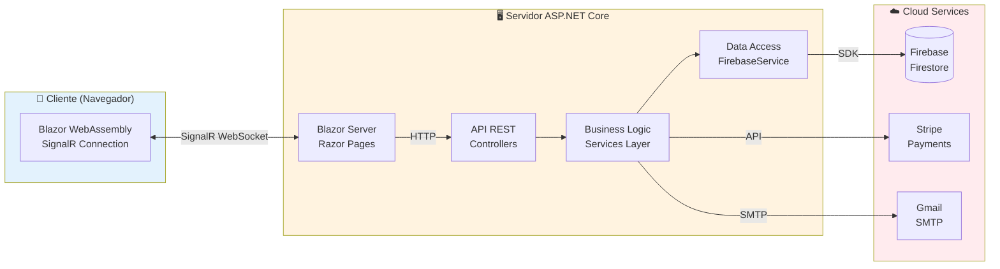

# Diagrama de Componentes - Sistema de Gestión de Taller Mecánico

## Diagrama de Componentes en Mermaid

```mermaid
graph TB
    %% ============================================
    %% CAPA DE PRESENTACIÓN (Frontend)
    %% ============================================
    subgraph FRONTEND["🖥️ CAPA DE PRESENTACIÓN - Blazor Server"]
        direction TB
        
        subgraph PAGES["📄 Páginas Razor"]
            LOGIN[Login.razor]
            REGISTRO[Registro.razor]
            INDEX[Index.razor]
            
            subgraph CLIENTE_PAGES["Cliente Pages"]
                SERVICIOS_DISP[ServiciosDisponibles.razor]
                MIS_SERVICIOS[MisServicios.razor]
                CLIENTE_FACTURAS[Cliente/MisFacturas.razor]
                CLIENTE_ABONOS[Cliente/MisAbonos.razor]
            end
            
            subgraph EMPLEADO_PAGES["Empleado Pages"]
                EMP_DASHBOARD[EmpleadoDashboard.razor]
                EMP_SOLICITUDES[Empleados.razor]
                GENERAR_FACTURA[GenerarFactura.razor]
            end
            
            subgraph ADMIN_PAGES["Admin Pages"]
                ADMIN_PRODUCTOS[Admin/Productos.razor]
                ADMIN_SERVICIOS[Admin/Servicios.razor]
                ADMIN_EMPLEADOS[Admin/Empleados.razor]
                ADMIN_REPORTES[Admin/Reportes.razor]
            end
        end
        
        subgraph SHARED["🔄 Componentes Compartidos"]
            APP[App.razor]
            MAIN_LAYOUT[MainLayout.razor]
            NAV_MENU[NavMenu.razor]
            EMPTY_LAYOUT[EmptyLayout.razor]
            AUTH_REDIRECT[RedirectToLogin.razor]
        end
        
        subgraph AUTH_PROVIDER["🔐 Autenticación"]
            CUSTOM_AUTH[CustomAuthStateProvider]
        end
    end

    %% ============================================
    %% CAPA DE API (Controllers)
    %% ============================================
    subgraph API_LAYER["🌐 CAPA DE API - ASP.NET Core Controllers"]
        direction TB
        
        AUTH_CTRL[AuthController<br/>POST /api/auth/login<br/>POST /api/auth/registro]
        
        EMPLEADO_CTRL[EmpleadoController<br/>GET/POST/PUT/DELETE<br/>/api/empleado]
        
        PRODUCTO_CTRL[ProductoController<br/>GET/POST/PUT/DELETE<br/>/api/producto]
        
        SERVICIO_CTRL[ServicioController<br/>GET/POST/PUT/DELETE<br/>/api/servicio]
        
        SOLICITUD_CTRL[SolicitudController<br/>GET/POST/PUT<br/>/api/solicitud]
        
        FACTURA_CTRL[FacturaController<br/>GET/POST<br/>/api/factura]
        
        ABONO_CTRL[AbonoController<br/>GET/POST<br/>/api/abono]
        
        PAGO_CTRL[PagoController<br/>POST /api/pago/stripe<br/>GET /api/pago/success]
    end

    %% ============================================
    %% CAPA DE LÓGICA DE NEGOCIO (Services)
    %% ============================================
    subgraph BUSINESS_LAYER["⚙️ CAPA DE LÓGICA DE NEGOCIO - Services"]
        direction TB
        
        subgraph CORE_SERVICES["Core Services"]
            AUTH_SVC[AuthService<br/>Login, Registro<br/>Hash passwords]
            
            EMPLEADO_SVC[EmpleadoService<br/>CRUD Empleados<br/>Validación cruzada]
            
            PRODUCTO_SVC[ProductoService<br/>CRUD Productos<br/>Control de Stock]
            
            SERVICIO_SVC[ServicioService<br/>CRUD Servicios<br/>Catálogo]
            
            SOLICITUD_SVC[SolicitudService<br/>Gestión Solicitudes<br/>Estados y Asignación]
            
            FACTURA_SVC[FacturaService<br/>Generación Facturas<br/>Cálculo Comisiones]
            
            ABONO_SVC[AbonoService<br/>Registro Pagos<br/>Actualización Saldos]
        end
        
        subgraph SUPPORT_SERVICES["Support Services"]
            EMAIL_SVC[EmailService<br/>Envío de correos<br/>SMTP Gmail]
            
            BARCODE_SVC[CodigoBarrasService<br/>Generación códigos<br/>CODE_128 Base64]
            
            STRIPE_SVC[StripePaymentService<br/>Integración Stripe<br/>Sesiones de pago]
            
            GANANCIA_SVC[GananciaService<br/>Cálculo ganancias<br/>Reportes mensuales]
        end
    end

    %% ============================================
    %% CAPA DE DATOS (Data Layer)
    %% ============================================
    subgraph DATA_LAYER["🗄️ CAPA DE DATOS - Firebase Integration"]
        direction TB
        
        FIREBASE_SVC[FirebaseService<br/>Operaciones CRUD<br/>Conexión Firestore]
        
        DATA_SEEDER[DataSeeder<br/>Datos iniciales<br/>Usuario Admin]
    end

    %% ============================================
    %% CAPA DE MODELOS (Domain Models)
    %% ============================================
    subgraph MODELS["📦 MODELOS DE DOMINIO"]
        direction LR
        
        USER_MODELS[Usuario<br/>Cliente<br/>Empleado]
        
        SERVICE_MODELS[Servicio<br/>SolicitudServicio]
        
        PRODUCT_MODELS[Producto]
        
        INVOICE_MODELS[Factura<br/>DetalleFactura<br/>Abono]
        
        DTO_MODELS[DTOs Validados<br/>LoginRequestValidated<br/>ProductoValidado<br/>etc.]
    end

    %% ============================================
    %% SERVICIOS EXTERNOS
    %% ============================================
    subgraph EXTERNAL["☁️ SERVICIOS EXTERNOS"]
        FIRESTORE[(Firebase<br/>Firestore<br/>NoSQL Database)]
        
        GMAIL[Gmail SMTP<br/>Envío de emails<br/>Puerto 587]
        
        STRIPE_API[Stripe API<br/>Pasarela de pagos<br/>Webhooks]
        
        LOCALSTORAGE[Browser<br/>LocalStorage<br/>Estado Auth]
    end

    %% ============================================
    %% RELACIONES - FRONTEND → API
    %% ============================================
    LOGIN -->|HTTP POST| AUTH_CTRL
    REGISTRO -->|HTTP POST| AUTH_CTRL
    
    SERVICIOS_DISP -->|HTTP GET| SERVICIO_CTRL
    SERVICIOS_DISP -->|HTTP POST| SOLICITUD_CTRL
    
    MIS_SERVICIOS -->|HTTP GET| SOLICITUD_CTRL
    CLIENTE_FACTURAS -->|HTTP GET| FACTURA_CTRL
    CLIENTE_ABONOS -->|HTTP GET/POST| ABONO_CTRL
    
    EMP_SOLICITUDES -->|HTTP GET/PUT| SOLICITUD_CTRL
    GENERAR_FACTURA -->|HTTP POST| FACTURA_CTRL
    GENERAR_FACTURA -->|HTTP GET| PRODUCTO_CTRL
    
    ADMIN_PRODUCTOS -->|HTTP GET/POST/PUT/DELETE| PRODUCTO_CTRL
    ADMIN_SERVICIOS -->|HTTP GET/POST/PUT/DELETE| SERVICIO_CTRL
    ADMIN_EMPLEADOS -->|HTTP GET/POST/PUT/DELETE| EMPLEADO_CTRL
    ADMIN_REPORTES -->|HTTP GET| FACTURA_CTRL
    
    %% ============================================
    %% RELACIONES - API → SERVICES
    %% ============================================
    AUTH_CTRL --> AUTH_SVC
    EMPLEADO_CTRL --> EMPLEADO_SVC
    PRODUCTO_CTRL --> PRODUCTO_SVC
    SERVICIO_CTRL --> SERVICIO_SVC
    SOLICITUD_CTRL --> SOLICITUD_SVC
    FACTURA_CTRL --> FACTURA_SVC
    ABONO_CTRL --> ABONO_SVC
    PAGO_CTRL --> STRIPE_SVC
    
    %% ============================================
    %% RELACIONES - SERVICES → DATA
    %% ============================================
    AUTH_SVC --> FIREBASE_SVC
    EMPLEADO_SVC --> FIREBASE_SVC
    PRODUCTO_SVC --> FIREBASE_SVC
    SERVICIO_SVC --> FIREBASE_SVC
    SOLICITUD_SVC --> FIREBASE_SVC
    FACTURA_SVC --> FIREBASE_SVC
    ABONO_SVC --> FIREBASE_SVC
    GANANCIA_SVC --> FIREBASE_SVC
    
    %% ============================================
    %% RELACIONES - SERVICES INTERDEPENDIENTES
    %% ============================================
    FACTURA_SVC -.->|usa| SOLICITUD_SVC
    FACTURA_SVC -.->|usa| PRODUCTO_SVC
    FACTURA_SVC -.->|usa| EMAIL_SVC
    FACTURA_SVC -.->|usa| BARCODE_SVC
    ABONO_SVC -.->|usa| FACTURA_SVC
    
    %% ============================================
    %% RELACIONES - SERVICES → MODELS
    %% ============================================
    AUTH_SVC -.-> USER_MODELS
    EMPLEADO_SVC -.-> USER_MODELS
    SERVICIO_SVC -.-> SERVICE_MODELS
    SOLICITUD_SVC -.-> SERVICE_MODELS
    PRODUCTO_SVC -.-> PRODUCT_MODELS
    FACTURA_SVC -.-> INVOICE_MODELS
    ABONO_SVC -.-> INVOICE_MODELS
    
    AUTH_CTRL -.-> DTO_MODELS
    PRODUCTO_CTRL -.-> DTO_MODELS
    SERVICIO_CTRL -.-> DTO_MODELS
    
    %% ============================================
    %% RELACIONES - DATA → EXTERNAL
    %% ============================================
    FIREBASE_SVC -->|SDK| FIRESTORE
    EMAIL_SVC -->|SMTP| GMAIL
    STRIPE_SVC -->|REST API| STRIPE_API
    CUSTOM_AUTH -->|Store| LOCALSTORAGE
    
    %% ============================================
    %% ESTILOS
    %% ============================================
    classDef frontend fill:#e1f5ff,stroke:#01579b,stroke-width:2px
    classDef api fill:#fff3e0,stroke:#e65100,stroke-width:2px
    classDef business fill:#f3e5f5,stroke:#4a148c,stroke-width:2px
    classDef data fill:#e8f5e9,stroke:#1b5e20,stroke-width:2px
    classDef external fill:#ffebee,stroke:#b71c1c,stroke-width:2px
    classDef models fill:#fff9c4,stroke:#f57f17,stroke-width:2px
    
    class LOGIN,REGISTRO,INDEX,SERVICIOS_DISP,MIS_SERVICIOS,CLIENTE_FACTURAS,CLIENTE_ABONOS,EMP_DASHBOARD,EMP_SOLICITUDES,GENERAR_FACTURA,ADMIN_PRODUCTOS,ADMIN_SERVICIOS,ADMIN_EMPLEADOS,ADMIN_REPORTES,APP,MAIN_LAYOUT,NAV_MENU,EMPTY_LAYOUT,AUTH_REDIRECT,CUSTOM_AUTH frontend
    
    class AUTH_CTRL,EMPLEADO_CTRL,PRODUCTO_CTRL,SERVICIO_CTRL,SOLICITUD_CTRL,FACTURA_CTRL,ABONO_CTRL,PAGO_CTRL api
    
    class AUTH_SVC,EMPLEADO_SVC,PRODUCTO_SVC,SERVICIO_SVC,SOLICITUD_SVC,FACTURA_SVC,ABONO_SVC,EMAIL_SVC,BARCODE_SVC,STRIPE_SVC,GANANCIA_SVC business
    
    class FIREBASE_SVC,DATA_SEEDER data
    
    class FIRESTORE,GMAIL,STRIPE_API,LOCALSTORAGE external
    
    class USER_MODELS,SERVICE_MODELS,PRODUCT_MODELS,INVOICE_MODELS,DTO_MODELS models
```



---

## Diagrama Simplificado de Arquitectura



---

## 📋 Descripción de Componentes

### 🖥️ **CAPA DE PRESENTACIÓN** (Frontend - Blazor Server)

#### 📄 Páginas Razor (Razor Components)

**Páginas Públicas:**
- **Login.razor**: Autenticación de usuarios (Cliente, Empleado, Admin)
- **Registro.razor**: Registro de nuevos clientes
- **Index.razor**: Página principal/dashboard según rol

**Páginas Cliente:**
- **ServiciosDisponibles.razor**: Catálogo de servicios disponibles para solicitar
- **MisServicios.razor**: Historial de solicitudes del cliente
- **Cliente/MisFacturas.razor**: Facturas del cliente (pagadas y pendientes)
- **Cliente/MisAbonos.razor**: Registro de pagos realizados

**Páginas Empleado:**
- **EmpleadoDashboard.razor**: Panel principal del empleado
- **Empleados.razor**: Lista de solicitudes pendientes y asignadas
- **GenerarFactura.razor**: Formulario para generar factura desde solicitud

**Páginas Administrador:**
- **Admin/Productos.razor**: CRUD de productos (repuestos)
- **Admin/Servicios.razor**: CRUD del catálogo de servicios
- **Admin/Empleados.razor**: Gestión de empleados y comisiones
- **Admin/Reportes.razor**: Reportes de ganancias y estadísticas

#### 🔄 Componentes Compartidos

- **App.razor**: Componente raíz de la aplicación Blazor
- **MainLayout.razor**: Layout principal con menú de navegación
- **NavMenu.razor**: Menú lateral dinámico según rol de usuario
- **EmptyLayout.razor**: Layout vacío para Login/Registro
- **RedirectToLogin.razor**: Componente de redirección para rutas protegidas

#### 🔐 Autenticación

- **CustomAuthStateProvider**: Proveedor personalizado de estado de autenticación
  - Gestiona sesión del usuario
  - Almacena datos en LocalStorage
  - Proporciona ClaimsPrincipal para autorización

---

### 🌐 **CAPA DE API** (Controllers - ASP.NET Core)

#### Controladores REST API

**AuthController** (`/api/auth`)
- `POST /login` - Autenticar usuario
- `POST /registro` - Registrar nuevo cliente

**EmpleadoController** (`/api/empleado`)
- `GET /` - Listar empleados activos
- `GET /{id}` - Obtener empleado por ID
- `POST /` - Registrar nuevo empleado
- `PUT /{id}` - Actualizar empleado
- `DELETE /{id}` - Eliminar empleado (soft delete)

**ProductoController** (`/api/producto`)
- `GET /` - Listar productos activos
- `GET /{id}` - Obtener producto por ID
- `POST /` - Crear nuevo producto
- `PUT /{id}` - Actualizar producto
- `DELETE /{id}` - Eliminar producto

**ServicioController** (`/api/servicio`)
- `GET /` - Listar servicios activos
- `GET /{id}` - Obtener servicio por ID
- `POST /` - Crear nuevo servicio
- `PUT /{id}` - Actualizar servicio
- `DELETE /{id}` - Eliminar servicio

**SolicitudController** (`/api/solicitud`)
- `GET /` - Listar todas las solicitudes
- `GET /pendientes` - Solicitudes sin asignar
- `GET /cliente/{id}` - Solicitudes de un cliente
- `GET /empleado/{id}` - Solicitudes de un empleado
- `POST /` - Crear nueva solicitud
- `PUT /{id}/asignar` - Asignar empleado y servicio
- `PUT /{id}/completar` - Marcar como completada

**FacturaController** (`/api/factura`)
- `GET /` - Listar todas las facturas
- `GET /cliente/{id}` - Facturas de un cliente
- `GET /{id}` - Obtener factura por ID
- `POST /` - Crear factura directa
- `POST /generar/{solicitudId}` - Generar desde solicitud

**AbonoController** (`/api/abono`)
- `GET /factura/{id}` - Abonos de una factura
- `GET /cliente/{id}` - Abonos de un cliente
- `POST /` - Registrar nuevo abono

**PagoController** (`/api/pago`)
- `POST /stripe` - Crear sesión de pago Stripe
- `GET /success` - Callback de pago exitoso
- `GET /cancel` - Callback de pago cancelado

---

### ⚙️ **CAPA DE LÓGICA DE NEGOCIO** (Services)

#### Core Services (Servicios Principales)

**AuthService**
- Responsabilidad: Autenticación y registro de usuarios
- Métodos clave:
  - `LoginAsync(username, password)` - Valida credenciales
  - `RegistrarUsuarioAsync(usuario)` - Crea nuevo cliente
  - `HashPassword(password)` - Encriptar contraseñas SHA256

**EmpleadoService**
- Responsabilidad: Gestión de empleados
- Métodos clave:
  - `RegistrarEmpleadoAsync(empleado)` - Crea empleado
  - `ExisteNombreUsuarioEnSistemaAsync(username)` - Validación cruzada
  - `ObtenerEmpleadosAsync()` - Lista empleados activos

**ProductoService**
- Responsabilidad: Gestión de inventario
- Métodos clave:
  - `ReducirStockAsync(productoId, cantidad)` - Descuenta stock
  - `AumentarStockAsync(productoId, cantidad)` - Incrementa stock
  - `ObtenerProductosAsync()` - Lista productos disponibles

**ServicioService**
- Responsabilidad: Catálogo de servicios
- Métodos clave:
  - `ObtenerServiciosAsync()` - Lista servicios activos
  - `RegistrarServicioAsync(servicio)` - Crea servicio
  - `ActualizarServicioAsync(servicio)` - Modifica servicio

**SolicitudService**
- Responsabilidad: Flujo de solicitudes de servicio
- Métodos clave:
  - `ObtenerSolicitudesPendientesAsync()` - Sin asignar
  - `AsignarEmpleadoAsync(solicitudId, empleadoId, servicioId)` - Tomar solicitud
  - `CompletarSolicitudAsync(solicitudId)` - Marcar completada

**FacturaService**
- Responsabilidad: Generación y gestión de facturas
- Métodos clave:
  - `GenerarFacturaDesdeOrdenAsync(solicitudId, detalles)` - Crea factura
  - `GenerarNumeroFacturaAsync()` - Número único
  - `MarcarComoPagadaAsync(facturaId)` - Actualiza estado
- Dependencias: SolicitudService, ProductoService, EmailService, CodigoBarrasService

**AbonoService**
- Responsabilidad: Registro de pagos
- Métodos clave:
  - `RegistrarAbonoAsync(abono)` - Crea pago y actualiza saldo
  - `ObtenerTotalAbonadoAsync(facturaId)` - Suma pagos
- Dependencias: FacturaService

#### Support Services (Servicios de Soporte)

**EmailService**
- Responsabilidad: Envío de correos electrónicos
- Tecnología: MailKit + SMTP Gmail
- Métodos clave:
  - `EnviarFacturaPorEmailAsync(destinatario, asunto, cuerpo, pdfBytes)` - Envía factura
  - `EnviarEmailAsync(destinatario, asunto, cuerpo, html)` - Email genérico

**CodigoBarrasService**
- Responsabilidad: Generación de códigos de barras
- Tecnología: ZXing.Net
- Métodos clave:
  - `GenerarCodigoBarras(numeroFactura)` - Retorna Base64 del código CODE_128

**StripePaymentService**
- Responsabilidad: Integración con pasarela de pagos
- Tecnología: Stripe.net
- Métodos clave:
  - `CrearSesionPagoAsync(facturaId, monto, clienteEmail, numeroFactura)` - Crea checkout
  - `VerificarPagoAsync(sessionId)` - Valida pago exitoso

**GananciaService**
- Responsabilidad: Cálculo de reportes financieros
- Métodos clave:
  - `ObtenerGananciasAsync()` - Total general
  - `ObtenerGananciasPorEmpleadoAsync()` - Desglose por empleado
  - `ObtenerGananciasMensualesAsync(mes, año)` - Filtro temporal

---

### 🗄️ **CAPA DE DATOS** (Data Layer)

**FirebaseService**
- Responsabilidad: Comunicación con Firebase Firestore
- Tecnología: Google.Cloud.Firestore SDK
- Métodos clave:
  - `GetCollection(collectionName)` - Referencia a colección
  - `GetDocumentAsync(collection, documentId)` - Obtener documento
  - `AddDocumentAsync(collection, data)` - Insertar documento
  - `UpdateDocumentAsync(collection, documentId, data)` - Actualizar
  - `DeleteDocumentAsync(collection, documentId)` - Eliminar

**DataSeeder**
- Responsabilidad: Datos iniciales del sistema
- Ejecución: Al iniciar aplicación (Program.cs)
- Funcionalidad:
  - Crea usuario administrador por defecto
  - Usuario: "admin", Password: "admin123"

---

### 📦 **MODELOS DE DOMINIO**

**User Models:**
- `Usuario` (clase base)
- `Cliente` (hereda de Usuario)
- `Empleado` (hereda de Usuario)

**Service Models:**
- `Servicio` (catálogo)
- `SolicitudServicio` (pedidos)
- `EstadoSolicitud` (enum)

**Product Models:**
- `Producto` (repuestos)

**Invoice Models:**
- `Factura`
- `DetalleFactura` (líneas de productos)
- `Abono` (pagos)

**DTOs Validados:**
- `LoginRequestValidated`
- `UsuarioRegistroValidado`
- `EmpleadoValidado`
- `ProductoValidado`
- `ServicioValidado`
- `SolicitudServicioValidado`
- `AbonoValidado`
- `UsuarioDto`

---

### ☁️ **SERVICIOS EXTERNOS**

**Firebase Firestore**
- Tipo: Base de datos NoSQL en la nube
- Uso: Almacenamiento de todas las entidades
- Conexión: Google.Cloud.Firestore SDK
- Credenciales: `firebase-credentials.json`

**Gmail SMTP**
- Tipo: Servidor de correo saliente
- Uso: Envío de facturas por email
- Puerto: 587 (TLS)
- Configuración: `appsettings.json`

**Stripe API**
- Tipo: Pasarela de pagos
- Uso: Pagos online con tarjeta
- Versión: Stripe.net v49.0.0
- Moneda: MXN (Pesos mexicanos)

**Browser LocalStorage**
- Tipo: Almacenamiento local del navegador
- Uso: Persistir estado de autenticación
- Tecnología: Blazored.LocalStorage

---

## 🔄 Flujo de Comunicación

### Flujo de Autenticación
```
1. Login.razor → AuthController.Login()
2. AuthController → AuthService.LoginAsync()
3. AuthService → FirebaseService (query usuarios/empleados)
4. FirebaseService → Firestore (consulta BD)
5. Respuesta: Usuario con hash validado
6. CustomAuthStateProvider almacena en LocalStorage
7. Redirección a página según rol
```

### Flujo de Generación de Factura
```
1. EmpleadoDashboard.razor → toma solicitud
2. GenerarFactura.razor → selecciona productos
3. FacturaController.GenerarFacturaDesdeOrden()
4. FacturaService.GenerarFacturaDesdeOrdenAsync()
   ├─> SolicitudService.CompletarSolicitudAsync()
   ├─> ProductoService.ReducirStockAsync() (por cada producto)
   ├─> CodigoBarrasService.GenerarCodigoBarras()
   ├─> FirebaseService.AddDocumentAsync() (guarda factura)
   └─> EmailService.EnviarFacturaPorEmailAsync()
5. FirebaseService → Firestore (persiste datos)
6. EmailService → Gmail SMTP (envía email)
7. Respuesta: Factura generada con código de barras
```

### Flujo de Pago con Stripe
```
1. Cliente/MisFacturas.razor → botón "Pagar con Stripe"
2. PagoController.CrearSesionPago()
3. StripePaymentService.CrearSesionPagoAsync()
4. Stripe API → crea checkout session
5. Redirige a Stripe Checkout
6. Cliente completa pago
7. Stripe → webhook a /api/pago/success
8. AbonoService.RegistrarAbonoAsync()
9. FacturaService.MarcarComoPagadaAsync()
10. Actualización en Firestore
```

---

## 🏗️ Patrones Arquitectónicos

### **Layered Architecture** (Arquitectura por Capas)
- **Presentación** → Blazor Pages/Components
- **API** → Controllers REST
- **Negocio** → Services Layer
- **Datos** → FirebaseService
- **Externos** → Cloud Services

### **Dependency Injection**
- Todos los servicios registrados en `Program.cs`
- Inyección por constructor
- Ciclo de vida: Scoped (por request)

### **Repository Pattern**
- `FirebaseService` actúa como repositorio genérico
- Abstrae operaciones CRUD sobre Firestore

### **Service Layer Pattern**
- Lógica de negocio centralizada en servicios
- Controllers delgados (solo validación y routing)

### **DTO Pattern**
- Separación entre modelos de dominio y DTOs
- Validación automática con Data Annotations

---

## 📊 Tecnologías por Capa

| Capa | Tecnologías |
|------|-------------|
| **Frontend** | Blazor Server, Razor Components, SignalR, Blazored.LocalStorage |
| **API** | ASP.NET Core 8.0, Controllers, Model Binding |
| **Business** | C# Services, LINQ, Async/Await |
| **Data** | Google.Cloud.Firestore, Firebase SDK |
| **External** | MailKit (SMTP), Stripe.net, ZXing.Net |

---

## 🔐 Seguridad

- **Autenticación**: CustomAuthStateProvider + LocalStorage
- **Autorización**: [Authorize] attributes en páginas
- **Encriptación**: SHA256 para contraseñas
- **HTTPS**: Certificado SSL requerido
- **CORS**: Configurado para dominios específicos
- **Validación**: Data Annotations + validación manual

---

## 📦 Dependencias Principales (NuGet)

```xml
<PackageReference Include="Google.Cloud.Firestore" Version="3.5.0" />
<PackageReference Include="Stripe.net" Version="49.0.0" />
<PackageReference Include="MailKit" Version="4.3.0" />
<PackageReference Include="ZXing.Net" Version="0.16.9" />
<PackageReference Include="Blazored.LocalStorage" Version="4.5.0" />
```

---

## 🚀 Despliegue

**Requisitos:**
- .NET 8.0 Runtime
- Firebase project con Firestore habilitado
- Cuenta Gmail para SMTP
- Cuenta Stripe para pagos
- Windows Server / Linux / Azure App Service

**Configuración:**
- `firebase-credentials.json` en raíz del proyecto
- Variables de entorno o `appsettings.json`:
  - Firebase credentials
  - Gmail username/password
  - Stripe API keys
