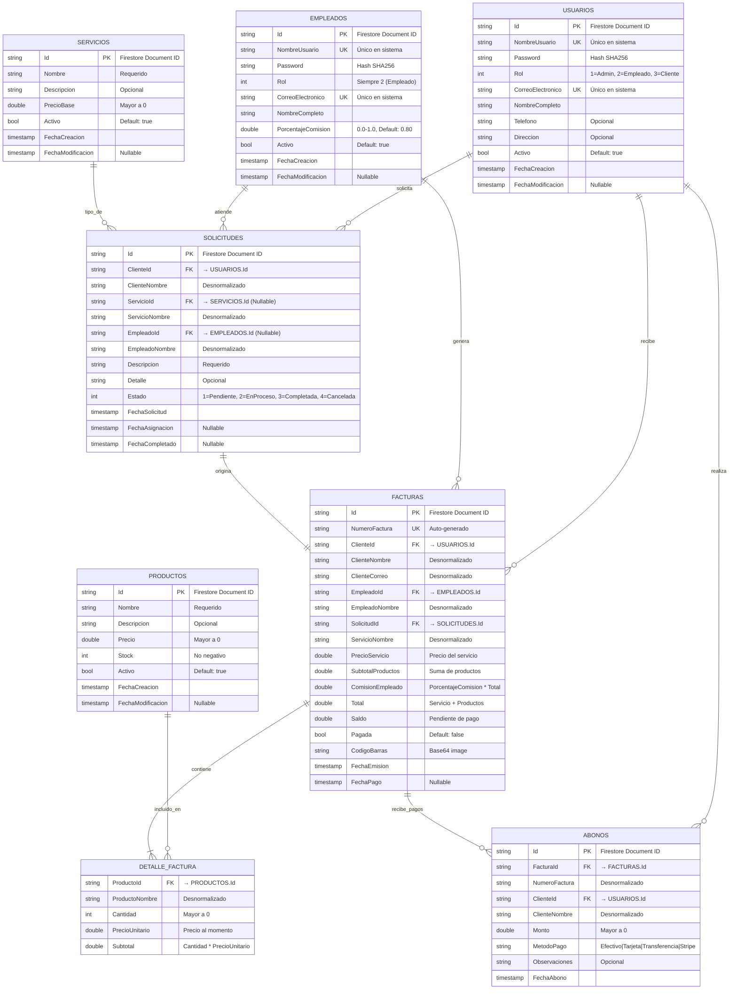
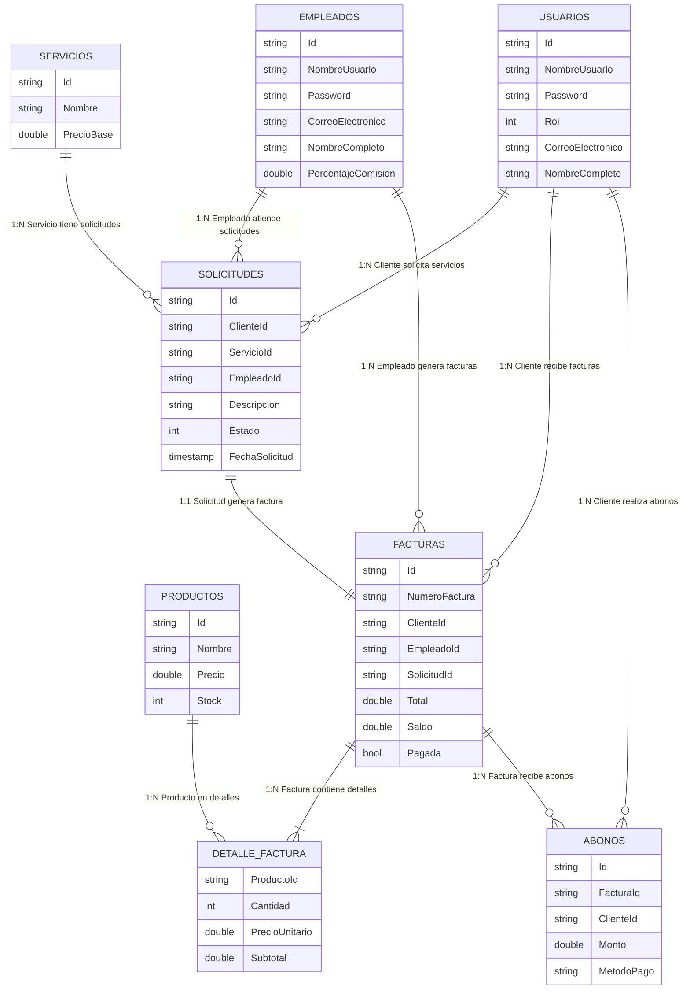

# Diagrama Entidad-Relación - Sistema de Gestión de Taller Mecánico

## Diagrama ER en Mermaid



## Diagrama ER Alternativo (Notación Chen)



---

## 📋 Descripción de Entidades

### 👥 **USUARIOS** (Colección: `usuarios`)
**Descripción**: Clientes del taller que solicitan servicios  
**Clave Primaria**: `Id` (Document ID de Firestore)  
**Claves Únicas**: `NombreUsuario`, `CorreoElectronico`  
**Cardinalidad**:
- 1 Usuario → N Solicitudes (0..*)
- 1 Usuario → N Facturas (0..*)
- 1 Usuario → N Abonos (0..*)

### 👷 **EMPLEADOS** (Colección: `empleados`)
**Descripción**: Mecánicos que atienden servicios y generan facturas  
**Clave Primaria**: `Id` (Document ID de Firestore)  
**Claves Únicas**: `NombreUsuario`, `CorreoElectronico`  
**Atributo Especial**: `PorcentajeComision` (porcentaje de ganancia por servicio)  
**Cardinalidad**:
- 1 Empleado → N Solicitudes (0..*)
- 1 Empleado → N Facturas (0..*)

### 🛠️ **SERVICIOS** (Colección: `servicios`)
**Descripción**: Catálogo de servicios ofrecidos (Cambio de aceite, Alineación, etc.)  
**Clave Primaria**: `Id`  
**Cardinalidad**:
- 1 Servicio → N Solicitudes (0..*)

### 📦 **PRODUCTOS** (Colección: `productos`)
**Descripción**: Repuestos y productos vendidos durante servicios  
**Clave Primaria**: `Id`  
**Control**: `Stock` se reduce automáticamente al generar factura  
**Cardinalidad**:
- 1 Producto → N DetalleFactura (0..*)

### 📝 **SOLICITUDES** (Colección: `solicitudes`)
**Descripción**: Petición de servicio realizada por cliente  
**Clave Primaria**: `Id`  
**Claves Foráneas**:
- `ClienteId` → USUARIOS.Id
- `EmpleadoId` → EMPLEADOS.Id (nullable, asignado después)
- `ServicioId` → SERVICIOS.Id (nullable, asignado por empleado)

**Estados**:
1. Pendiente (cliente envió solicitud)
2. EnProceso (empleado la tomó)
3. Completada (factura generada)
4. Cancelada

**Cardinalidad**:
- N Solicitudes → 1 Usuario (cliente)
- N Solicitudes → 1 Empleado (0..1)
- N Solicitudes → 1 Servicio (0..1)
- 1 Solicitud → 1 Factura (cuando se completa)

### 🧾 **FACTURAS** (Colección: `facturas`)
**Descripción**: Documento fiscal que incluye servicio + productos  
**Clave Primaria**: `Id`  
**Clave Única**: `NumeroFactura` (formato: FACT-{timestamp})  
**Claves Foráneas**:
- `ClienteId` → USUARIOS.Id
- `EmpleadoId` → EMPLEADOS.Id
- `SolicitudId` → SOLICITUDES.Id

**Cálculos**:
- `Total` = `PrecioServicio` + `SubtotalProductos`
- `ComisionEmpleado` = `Total` × `PorcentajeComision`
- `Saldo` = `Total` - Σ(`ABONOS.Monto`)

**Características**:
- Incluye código de barras (Base64)
- Se envía por email al cliente
- `Pagada` = true cuando `Saldo` = 0

**Cardinalidad**:
- N Facturas → 1 Usuario (cliente)
- N Facturas → 1 Empleado
- 1 Factura → 1 Solicitud
- 1 Factura → N DetalleFactura (1..*)
- 1 Factura → N Abonos (0..*)

### 📄 **DETALLE_FACTURA** (Embedded en FACTURAS)
**Descripción**: Línea de producto incluida en factura  
**Tipo**: Sub-colección embebida (array dentro de FACTURAS)  
**Clave Foránea**: `ProductoId` → PRODUCTOS.Id  
**Cálculo**: `Subtotal` = `Cantidad` × `PrecioUnitario`  
**Desnormalización**: Se guarda `ProductoNombre` y `PrecioUnitario` al momento de la venta

**Cardinalidad**:
- N DetalleFactura → 1 Factura (parte de)
- N DetalleFactura → 1 Producto

### 💰 **ABONOS** (Colección: `abonos`)
**Descripción**: Pagos parciales o totales a facturas  
**Clave Primaria**: `Id`  
**Claves Foráneas**:
- `FacturaId` → FACTURAS.Id
- `ClienteId` → USUARIOS.Id

**Métodos de Pago**:
- Efectivo
- Tarjeta
- Transferencia
- Stripe (pago online)

**Lógica**:
- Al registrar abono, se actualiza `FACTURAS.Saldo`
- Si `Saldo` = 0, se marca `FACTURAS.Pagada` = true

**Cardinalidad**:
- N Abonos → 1 Factura
- N Abonos → 1 Usuario (cliente)

---

## 🔑 Restricciones de Integridad

### Claves Primarias (PK)
- Todas las entidades usan **Firestore Document ID** como PK
- Tipo: `string` (generado automáticamente)

### Claves Únicas (UK)
- `USUARIOS.NombreUsuario` - No puede repetirse en usuarios ni empleados
- `USUARIOS.CorreoElectronico` - No puede repetirse en usuarios ni empleados
- `EMPLEADOS.NombreUsuario` - No puede repetirse en usuarios ni empleados
- `EMPLEADOS.CorreoElectronico` - No puede repetirse en usuarios ni empleados
- `FACTURAS.NumeroFactura` - Formato FACT-{timestamp}

### Claves Foráneas (FK)
**SOLICITUDES**:
- `ClienteId` → USUARIOS.Id (obligatorio)
- `EmpleadoId` → EMPLEADOS.Id (nullable)
- `ServicioId` → SERVICIOS.Id (nullable)

**FACTURAS**:
- `ClienteId` → USUARIOS.Id (obligatorio)
- `EmpleadoId` → EMPLEADOS.Id (obligatorio)
- `SolicitudId` → SOLICITUDES.Id (obligatorio)

**DETALLE_FACTURA**:
- `ProductoId` → PRODUCTOS.Id (obligatorio)

**ABONOS**:
- `FacturaId` → FACTURAS.Id (obligatorio)
- `ClienteId` → USUARIOS.Id (obligatorio)

### Restricciones de Dominio
- `PRODUCTOS.Stock` ≥ 0
- `PRODUCTOS.Precio` > 0
- `SERVICIOS.PrecioBase` > 0
- `EMPLEADOS.PorcentajeComision` entre 0 y 1
- `SOLICITUDES.Estado` ∈ {1, 2, 3, 4}
- `USUARIOS.Rol` ∈ {1, 2, 3}
- `ABONOS.Monto` > 0
- `DETALLE_FACTURA.Cantidad` > 0

---

## 📊 Cardinalidades

| Relación | Cardinalidad | Descripción |
|----------|--------------|-------------|
| USUARIOS → SOLICITUDES | 1:N | Un cliente puede tener muchas solicitudes |
| EMPLEADOS → SOLICITUDES | 1:N | Un empleado atiende muchas solicitudes |
| SERVICIOS → SOLICITUDES | 1:N | Un servicio puede estar en muchas solicitudes |
| SOLICITUDES → FACTURAS | 1:1 | Una solicitud genera exactamente una factura |
| USUARIOS → FACTURAS | 1:N | Un cliente puede tener muchas facturas |
| EMPLEADOS → FACTURAS | 1:N | Un empleado genera muchas facturas |
| FACTURAS → DETALLE_FACTURA | 1:N | Una factura contiene múltiples líneas de productos |
| PRODUCTOS → DETALLE_FACTURA | 1:N | Un producto puede estar en múltiples detalles |
| FACTURAS → ABONOS | 1:N | Una factura puede recibir múltiples pagos |
| USUARIOS → ABONOS | 1:N | Un cliente realiza múltiples pagos |

---

## 🗄️ Desnormalización en Firestore

### ¿Por qué se desnormaliza?

Firestore es una base de datos NoSQL, por lo tanto se duplican datos para optimizar consultas:

**Datos desnormalizados en SOLICITUDES**:
- `ClienteNombre` (desde USUARIOS)
- `ServicioNombre` (desde SERVICIOS)
- `EmpleadoNombre` (desde EMPLEADOS)

**Datos desnormalizados en FACTURAS**:
- `ClienteNombre`, `ClienteCorreo` (desde USUARIOS)
- `EmpleadoNombre` (desde EMPLEADOS)
- `ServicioNombre` (desde SERVICIOS)

**Datos desnormalizados en DETALLE_FACTURA**:
- `ProductoNombre` (desde PRODUCTOS)
- `PrecioUnitario` (precio histórico al momento de venta)

**Datos desnormalizados en ABONOS**:
- `NumeroFactura` (desde FACTURAS)
- `ClienteNombre` (desde USUARIOS)

### Ventajas:
✅ Menos consultas (no necesita JOINs)  
✅ Mejor rendimiento en lecturas  
✅ Historial correcto (precios al momento de venta)

### Desventajas:
⚠️ Redundancia de datos  
⚠️ Actualizaciones más complejas (múltiples colecciones)

---

## 🔄 Flujo de Datos Principal

```
1. CLIENTE crea SOLICITUD
   └─> Estado = Pendiente

2. EMPLEADO toma SOLICITUD
   └─> Estado = EnProceso
   └─> Asigna ServicioId

3. EMPLEADO genera FACTURA
   └─> Relaciona con SOLICITUD
   └─> Agrega PRODUCTOS (DETALLE_FACTURA)
   └─> Calcula Total y Comisión
   └─> SOLICITUD.Estado = Completada

4. CLIENTE realiza ABONOS
   └─> Reduce FACTURAS.Saldo
   └─> Si Saldo = 0 → Pagada = true
```

---

## 📈 Índices Recomendados (Firestore)

Para optimizar consultas frecuentes:

```
SOLICITUDES:
  - ClienteId (para listar solicitudes de un cliente)
  - EmpleadoId (para listar solicitudes de un empleado)
  - Estado (para filtrar por estado)
  - Composite: [Estado, FechaSolicitud] (para pendientes ordenadas)

FACTURAS:
  - ClienteId (para facturas de un cliente)
  - EmpleadoId (para facturas de un empleado)
  - Pagada (para facturas pendientes)
  - NumeroFactura (búsqueda única)

ABONOS:
  - FacturaId (para pagos de una factura)
  - ClienteId (para pagos de un cliente)

PRODUCTOS:
  - Activo (para productos disponibles)

USUARIOS:
  - NombreUsuario (para login)
  - Activo (para usuarios activos)
```

---

## 🔐 Reglas de Seguridad (Firestore Security Rules)

```javascript
// Usuarios solo pueden leer/escribir sus propios documentos
match /usuarios/{userId} {
  allow read, write: if request.auth.uid == userId;
}

// Solicitudes: cliente solo ve las suyas, empleado ve asignadas
match /solicitudes/{solicitudId} {
  allow read: if request.auth.uid == resource.data.ClienteId 
              || request.auth.uid == resource.data.EmpleadoId;
  allow create: if request.auth != null;
}

// Facturas: cliente solo ve las suyas
match /facturas/{facturaId} {
  allow read: if request.auth.uid == resource.data.ClienteId 
              || request.auth.uid == resource.data.EmpleadoId;
}
```

---

## 📝 Notas Técnicas

- **Firestore Document ID**: Se usa como PK en todas las colecciones
- **Timestamps**: Almacenados en UTC (`DateTime.UtcNow`)
- **Soft Delete**: Todas las entidades usan `Activo` boolean para eliminación lógica
- **No hay JOINs**: Firestore no soporta JOINs, por eso la desnormalización
- **Subcollections vs Arrays**: `DETALLE_FACTURA` es un array dentro de `FACTURAS` (no subcollection)
- **Transacciones**: Operaciones críticas (abonos, stock) usan transacciones de Firestore
