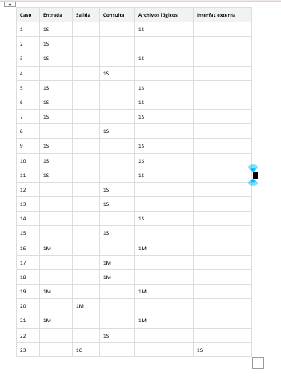
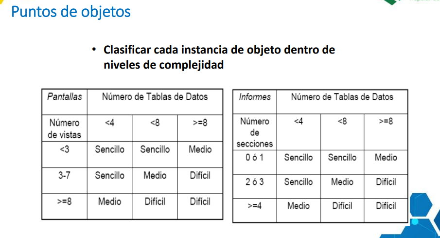
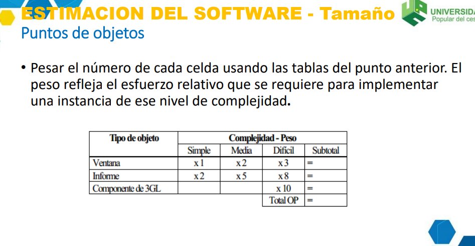
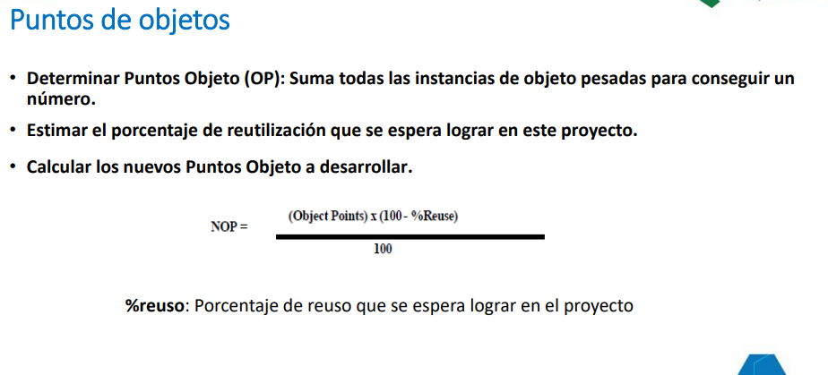
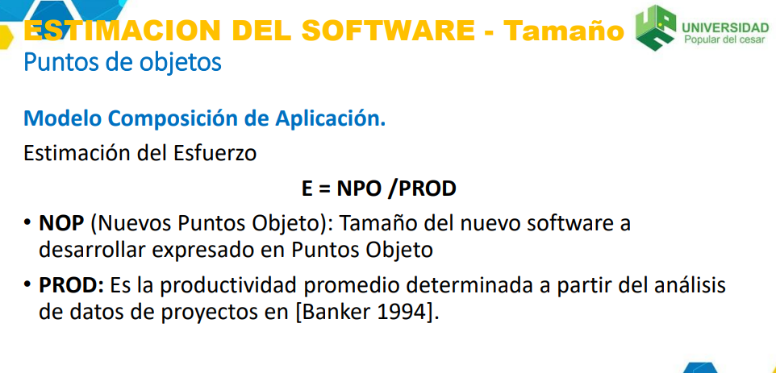
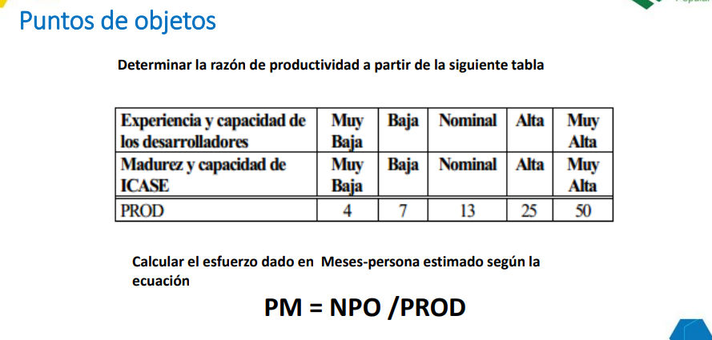

Código	Nombre del Requisito	Descripción Resumida	Actor Principal
RF-01	Registro de Clientes	Permite el registro de nuevos clientes en el sistema.	Cliente
RF-02	Inicio de Sesión	Autentica usuarios mediante nombre de usuario y contraseña.	Cliente / Empleado / Administrador
RF-03	Crear Empleado	El administrador puede registrar nuevos empleados.	Administrador
RF-04	Listar Empleados	Muestra la lista de empleados activos o todos.	Administrador
RF-05	Actualizar Empleado	Modifica datos personales, correo o comisión.	Administrador
RF-06	Eliminar Empleado	Desactiva a los empleados.	Administrador
RF-07	Crear Producto	Permite registrar productos en el inventario.	Administrador
RF-08	Listar Productos	Muestra todos los productos o solo los activos.	Administrador
RF-09	Actualizar Producto	Modifica información de productos existentes.	Administrador
RF-10	Eliminar Producto	Desactiva productos del catálogo.	Administrador
RF-11	Crear Solicitud	Clientes pueden crear solicitudes de servicio.	Cliente
RF-12	Listar Solicitudes por Cliente	Muestra las solicitudes de un cliente autenticado.	Cliente
RF-13	Listar Solicitudes por Empleado	Muestra solicitudes asignadas a un empleado.	Empleado
RF-14	Actualizar Estado de Solicitud	Cambia estado de solicitud (pendiente, proceso, completada, cancelada).	Empleado / Administrador
RF-15	Consultar Solicitud	Permite ver el detalle de una solicitud.	Cliente / Empleado / Administrador
RF-16	Generar Factura desde Solicitud	Crea factura vinculada a una solicitud completada.	Empleado
RF-17	Listar Facturas	Muestra todas las facturas registradas.	Administrador / Empleado
RF-18	Listar Facturas por Cliente	Permite al cliente consultar sus facturas.	Cliente
RF-19	Actualizar Estado de Pago	Permite marcar facturas como pagadas o pendientes.	Administrador
RF-20	Reenviar Factura por Email	Envía factura al correo del cliente.	Administrador / Sistema Externo (Email)
RF-21	Crear Abono	Permite registrar pagos parciales o totales.	Cliente
RF-22	Listar Abonos	Muestra todos los abonos realizados.	Administrador / Cliente
RF-23	Ver Ganancias del Taller y Exportar a PDF	Muestra información detallada de las ganancias del taller por mes.	Administrador

